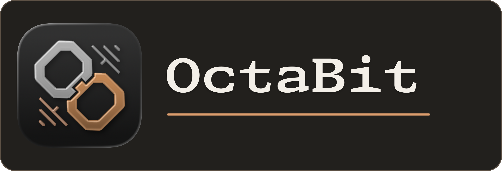

<p align="center">
    
</p>

Language/语言: English | [简体中文](./README.zh-Hans.md)

OctaBit is a browser-based tool for converting MIDI files into 8-bit style WAV audio. The public service is <https://octabit.cc>.

OctaBit's public OSS codebase is mirrored from a private upstream monorepo to `bagags/octabit`. The mirror is published so people can read, audit, run, and self-host the AGPL-licensed OSS code, but it is not an open contribution target and does not accept unsolicited pull requests. See [CONTRIBUTING.md](./CONTRIBUTING.md) before opening issues or arranging contribution work.

The production web frontend is the Vue 3 app in `frontend/`. The primary backend is the Go service in `backend/`, which implements the stable `/api/*` contract, workspace storage, synthesis jobs, and the Go MIDI-to-WAV renderer.

## What Is Active

| Path | Role |
| --- | --- |
| `frontend/` | Production Vue 3 frontend served from the Vite `dist` build |
| `backend/` | Primary Go backend API, workspace/synthesis service, Go renderer, and frozen Python parity fixtures |
| `assets/previews/` | Shared waveform preview WAV files served through the backend |
| `deploy/production/` | Non-Docker production deployment notes, helper script, and Caddy examples for Vue production |
| `docs/api-contract.md`, `docs/openapi.yaml` | Web API request and response contract |

## Run The Web App

From the repository root:

```bash
cd backend
PORT=8000 go run ./cmd/server
```

In another terminal, run the Vue frontend:

```bash
cd frontend
npm ci
npm run dev
```

Open `http://127.0.0.1:5173/`. Vite proxies `/api/*` and `/static/previews/*` to the Go backend on `127.0.0.1:8000`.

Run the routine checks:

```bash
cd backend && go test ./...
cd frontend && npm run build
```

## User Limits

These are the current default limits for the web app and renderer. Deployment operators can change web-service limits through environment variables, and renderer safety limits are enforced in the Go renderer.

| Limit | Default | Source |
| --- | ---: | --- |
| Request upload size | 20 MiB | `WEB_MAX_UPLOAD_BYTES` |
| Workspace lifetime after last activity | 86400 seconds | `WEB_WORKSPACE_TTL_SECONDS` |
| Queued MIDI files per workspace | 20 files | `WEB_WORKSPACE_MAX_QUEUED_FILES` |
| Total queued upload storage per workspace | 100 MiB | `WEB_WORKSPACE_MAX_UPLOAD_BYTES` |
| Converted WAV files per workspace | 20 files | `WEB_WORKSPACE_MAX_CONVERTED_FILES` |
| Active render workers per container | 2 workers | `WEB_RENDER_WORKERS` |
| Waiting render queue per container | 8 jobs | `WEB_RENDER_QUEUE_SIZE` |
| MIDI duration | 1800 seconds | renderer limit |
| Rendered samples | 172800000 samples | renderer limit |
| WAV sample data size | 345600000 bytes, about 329.6 MiB | renderer limit |
| MIDI notes | 20000 notes | renderer limit |
| Sound layers | 4 layers | renderer limit and web config |
| Frequency curve points per layer | 8 points | renderer limit |
| Sample rates | 44100, 48000, or 96000 Hz | web validation |
| Pulse duty cycle | 0.01 to 0.99 | renderer validation |
| Web layer volume | 0.0 to 2.0 | workspace config validation |
| Frequency curve gain | -36 dB to 12 dB | renderer validation |
| Frequency curve range | MIDI note 0 to 127 frequencies | renderer validation |

Queued uploads and converted WAV files are temporary. When users clear queued or converted files in the browser, the web app asks the server to delete the corresponding temporary files immediately.

## Web API

The Vue frontend uses anonymous, cookie-backed temporary workspaces through the Go API. `GET /api/workspace` creates or restores the workspace, and resource routes require the active workspace cookie. The readable API contract is in `docs/api-contract.md`, with the machine-readable OpenAPI contract in `docs/openapi.yaml`.

Primary routes:

- `GET /api/health`
- `GET /api/workspace`
- `POST /api/workspace/uploads`
- `DELETE /api/workspace/uploads/<file_id>`
- `PATCH /api/workspace/queue`
- `PUT /api/workspace/config`
- `POST /api/synthesis-jobs`
- `GET /api/synthesis-jobs/<job_id>`
- `GET /api/synthesis-jobs/<job_id>/download`
- `DELETE /api/synthesis-jobs/<job_id>`

API errors use `{"error":{"code":"...","message":"..."}}`.

## Sound Configuration

The web app stores sample rate and layer settings in the temporary workspace. Synthesis supports pulse, sine, sawtooth, and triangle layers. Frequency-gain curves are validated by the shared renderer and are applied per layer during synthesis.

Output naming:

- Single audible layer without a curve: `<original>_<wave>.wav`
- Multiple audible layers without a curve: `<original>_mix.wav`
- Any audible layer with a non-empty frequency curve: `<original>_<base>_<hash>.wav`

The hash is derived from the sanitised layer payload, so different curve settings do not reuse the same export name.

## Localisation

The production Vue UI keeps JSON catalog files under `frontend/src/i18n/` for English, Spanish, French, Japanese, Simplified Chinese (`zh-Hans`), and Traditional Chinese (`zh-Hant`). Keep `en.json`, `es.json`, `fr.json`, `ja.json`, `zh-Hans.json`, and `zh-Hant.json` key sets aligned in the production frontend catalogs. English is the fallback locale. Repository documentation remains English and Simplified Chinese. Follow the standard process in [docs/localisation.md](./docs/localisation.md).

User-facing web strings should go through the catalog rather than being hardcoded in templates or JavaScript.

## Deployment

The intended production model runs without Docker:

```bash
cd backend && go build -o octabit-server ./cmd/server
PORT=8000 WEB_SYNTHESISE_JOB_ROOT=/var/lib/octabit ./octabit-server
cd frontend && npm ci && npm run build
```

For public deployment, keep the Go backend private on `127.0.0.1:8000`. Caddy serves `frontend/dist` as the public frontend and reverse proxies `/api/*` and `/static/previews/*` to Go. Production deployment notes, Caddy examples, smoke checks, and rollback steps are in `deploy/production/README.md`.

## License

This project is licensed under the GNU Affero General Public License v3.0 or later (`AGPL-3.0-or-later`). See [LICENSE.md](./LICENSE.md) for details.
